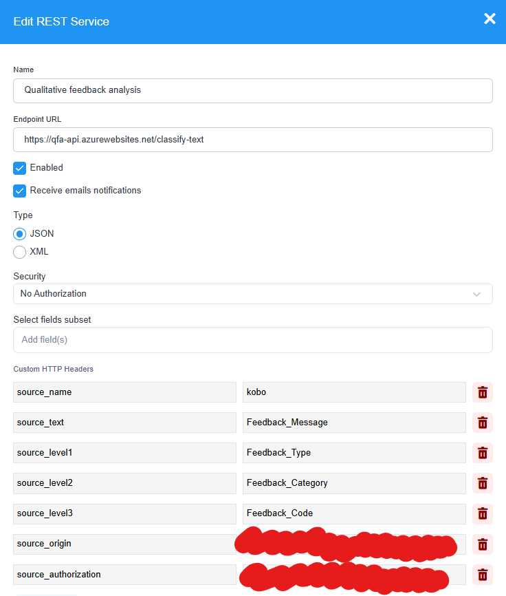

# qfa-api

Qualitative Feedback Analysis (QFA) API.

## Description

Synopsis: a [dockerized](https://www.docker.com/) [python](https://www.python.org/) API to analyze qualitative feedback.

Powered by [open-source language models](https://huggingface.co/). Uses [Poetry](https://python-poetry.org/) for dependency management.

## Setup classification with Kobo

1. Prepare a kobo form as follows:
   * add one question of type `text`, whose content will be classified. Example: `feedback`.
   * add up to three cascading select questions of type `select_one`, which determine how the text will be classified. Example: `type`, `category`, `code`.
   * fill in the possible choices in the `choices` sheet of the form exactly as explained [here](https://support.kobotoolbox.org/cascading_select.html#adding-cascading-question-sets-in-xlsform-option-1).
   * upload and deploy the form.

> [!TIP]
> The text will be classified according to the `labels` of the choices. A few tips to improve the accuracy of the classification:
>  * Phrase the label as if explaining to a 10-year-old. This helps the classification model grasp the core idea without unnecessary complexity.
>  * The model can**not** possibly know all humanitarian acronyms, so make sure to spell them out. Example: use `Water, Sanitation and Hygiene` instead of `WASH`, or `Red Crescent` instead of `RC`.
> * Avoid using ambiguous labels and be specific. Example: use `distribution of non-food items` and `distribution of cash` instead of `relief` and `cash`.
> * The more choices in the list you provide, the less accurate the classification will be. Keep the number of choices in the list as low as possible.
> * Try to use three synonyms when defining a label. Example: use `misinformation, fake news and made-up stories` in one label instead of only `misinformation`.

2. [Register a new Kobo REST Service](https://support.kobotoolbox.org/rest_services.html) and configure it as follows:
   * insert as `Endpoint URL`
    ```
    https://qfa-api.azurewebsites.net/classify-text
    ```
   * add the following headers under `Custom HTTP Headers`:
       * under `Name` insert `source-text` and under `Value` the name of the text question to be classified. Example: `feedback`.
       * under `Name` insert `source-name` and under `Value` just `kobo`.
       * under `Name` insert `source-origin` and under `Value` the ID of the form (see [where to find it](https://im.unhcr.org/kobosupport/)).
       * under `Name` insert `source-authorization` and under `Value` your Kobo token (see [how to get one](https://support.kobotoolbox.org/api.html#getting-your-api-token)).
       * under `Name` insert `source-level1` and under `Value` the name of the first of the cascading select questions. Example: `type`.
       * under `Name` insert `source-level2` and under `Value` the name of the second of the cascading select questions. Example: `category`.
       * under `Name` insert `source-level3` and under `Value` the name of the third of the cascading select questions. Example: `code`.

_That's it_. Your submissions will be automatically classified in a few seconds. Happy qualitative feedback analysis!




### Current limitations using QFA with Kobo forms
1. It is not possible to use [repeating groups](https://support.kobotoolbox.org/group_repeat.html) in Kobo forms and repeatedly submit the classification request to QFA. If it is needed to copy/paste data from a previous form into another multiple forms, one could look at how to use [dynamic data attachments](https://support.kobotoolbox.org/dynamic_data_attachment.html) instead. 
2. It is not possible to edit an already submitted Kobo form and then re-submit with the goal of classifying again. Kobo does not allow the REST service to be triggered twice for the same submission.

## Setup classification with EspoCRM

> [!WARNING]
> This functionality is not fully developed yet, but part of the documentation is already written

1. Prepare an EspoCRM entity as follows:
   * add one question of type `Text`, whose content will be classified. Example: `feedback`. Tip: enable 'Audited' so that changes can be traced.
   * add up to three questions of type `Enum`, which determine how the text will be classified. Example: `type`, `category`, `code`...
   * ensure the fields are visible in the desired layout.

2. Configure Flowcharts/Workflows. Prerequisite: an installed [Advanced Pack](https://www.espocrm.com/extensions/advanced-pack/)
   * create a new Flowchart
   * _More to come_

One of the features of QFA for EspoCRM is to be able to choose to save the classification result. A potential use case for this is when you want to receive the classification result from QFA but you first want to apply some business logic with the result before saving it to the source entity. The parameter `save` can be used as boolean for this.

Another functionality for EspoCRM is to the possibility to add `examples` for each label. This can be used to provide sample text or data that illustrates the type of content that falls under a particular classification. This can be useful for training, testing, and validating the classification model. 


## API Usage

See [the docs](https://qfa-api.azurewebsites.net/docs).

## Configuration

```sh
cp example.env .env
```

and edit the provided [ENV-variables](./example.env) accordingly.

### Run locally

```sh
pip install poetry
poetry install --no-root
uvicorn main:app --reload
```

